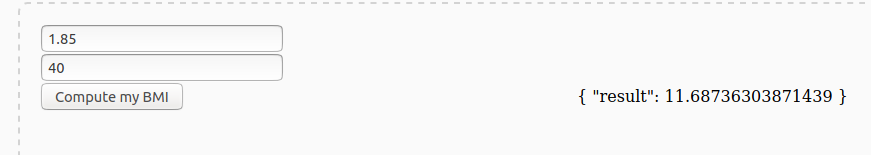

# Momo UI

A way to rapidly produce simple interactive UIs for any code.

```py
import momo


app = momo.Momo()


def bmi(height: float, weight: float) -> float:
    return weight / (height ** 2)


@app.page('/')
def bmi_page():

    with momo.Form() as f:
        # Create height & weight input
        height = f.input('My height', required=True)
        weight = f.input('My weight', required=True)
        # Create button 'Send'
        submit = f.button('Compute my BMI')
    # Create inputs area
    inputs = momo.layouts.Column(
        height,
        weight,
        submit,
    )
    # Create output area
    output = momo.div('output\noutput\noutput')
    # organise 
    layout = momo.layouts.Line(inputs, output)

    # Associate action [call <function> then store output in <output area>]
    submit.props['onclick'] = app.call(
        bmi,
        args={'height': height & float, 'weight': weight & float},
        output=output
    )

    return layout
```


